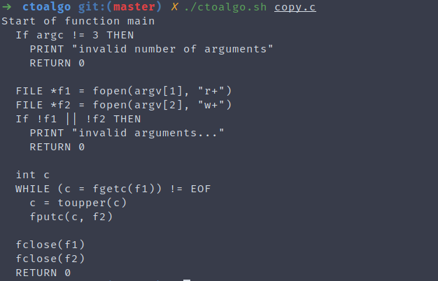

# CtoAlgo :notebook_with_decorative_cover:

A simple bash script to convert C code to Algorithm-ish formatter

## Screenshots

#### Standard C code


#### After Converting it


## Installation

```bash
git clone https://github.com/Roshan-R/ctoaglo.git
cd ctoAlgo
chmod +x ./ctoalgo.sh
```
## Contributing

Contributions are always welcome, free feel to do so!
