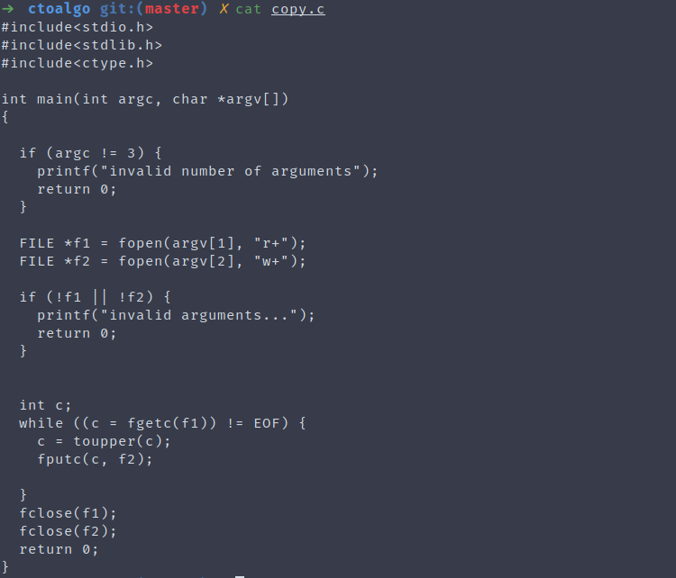

# CtoAlgo :notebook_with_decorative_cover:

A simple bash script to convert C code to Algorithm-ish format


## Installation

```bash
sudo apt install clang-format
git clone https://github.com/Roshan-R/ctoalgo.git
cd ctoalgo
chmod +x ./ctoalgo.sh
sudo cp ctoalgo.sh /usr/bin/ctoalgo 
```

## Using

```bash
ctoalgo example.c
```
prints converted code to STDOUT

for saving to a file, use output redirection

```bash
ctoalgo example.c > output.txt
```

## Screenshots

#### Standard C code


#### After Converting it


## Contributing

Contributions are always welcome, feel free to do so!
